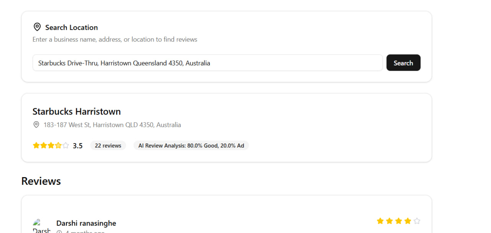

# 🎯 1. Filtering the Noise: ML for Trustworthy Location Reviews

A lightweight content-moderation pipeline that cleans Google-style location reviews and classifies them into **Good**, **Ad**, **Spam**, and **Rant** using a hybrid approach:

* ✅ **Rule filters** for the obvious cases (URLs, phone numbers, social handles, keyboard mashes, etc.)
* 🧠 **Pseudo-labeling** with a **teacher transformer** and optional **zero-shot** to auto-label the undecided
* 🤖 **Fine-tuning DistilBERT** with class-balancing and weighted loss
* 🚀 **One-file inference** to run predictions on new text


---

## ⚙️ Tech Stack
* Next JS & Typescript
* Python, FastAPI, Pandas, scikit-learn
* PyTorch, Hugging Face Transformers/Datasets
* DistilBERT sequence classification
* Optional Zero-Shot (`facebook/bart-large-mnli` by default)


---

## 🔧 Installation

```bash
# Python 3.10+ recommended
python -m venv .venv && source .venv/bin/activate

pip install -U pip
pip install "transformers>=4.44" "datasets>=3.0.0" evaluate scikit-learn torch pandas numpy
```

---

## 🚿 Step 1 — Clean + Pseudo-Label

`data_cleaning.py` does all of this:

* **Basic cleaning**: strip HTML, normalize whitespace, drop very short texts
* **Rule labeling** *(minimal & precise)*:

  * **Ad** if it contains URLs, emails, phone numbers, or social handles
  * **Spam** if it has multiple links, nonsense/keyboard mashes, etc.
  * **Rant** if it matches strong negative boilerplate (“worst service”, “never going back”, …)
  * else **Undecided**
* **Teacher pseudo-labels**: transformer assigns high-confidence predictions
* **Zero-shot** (optional) pass for extra labeling
* **Balanced train set** via upsampling
* **Stratified splits** for train/val/test (safe fallback if too imbalanced)
* **Outputs**: `data/processed/{train,val,test}.csv` + label maps

Run:

```bash
python data_cleaning.py
```

---

## 🏋️ Step 2 — Fine-Tune DistilBERT

`train_hf.py` fine-tunes a multi-class classifier with **weighted CrossEntropy** so minority labels matter.

Highlights:

* Tokenization with CUDA-friendly padding
* **WeightedTrainer** for class imbalance
* Clean training args (gradient accumulation, mixed precision)
* Validation + Test metrics with Hugging Face `Trainer`
* **Classification report + confusion matrix** printed at end
* Saves best checkpoint in `checkpoints/<model-name>-policy`

Run:

```bash
python train_hf.py
```

---

## 🔮 Step 3 — Inference on New Text

`main.py` loads the trained checkpoint and maps predictions back to labels.

Example inside script:

```python
texts = [
    "Great service and tasty waffles! Will come back.",
    "I hated the food, service was so bad and food took way too long to come",
    "CHEAP CHEAP apartments at yishun!! Contact me at https//www.github.com",
    "awoenweoiweicjwciwejwpedjwi3920e239rur34r83;lwemdlw",
]
```

Run:

```bash
python main.py
```

Example output:

```
TEXT: Great service and tasty waffles! Will come back.
PRED: Good  |  probs={'Good': 0.93, 'Ad': 0.02, 'Spam': 0.01, 'Rant': 0.04}
```

---

## 🧭 End-to-End Quickstart

```bash
# 0) Put raw reviews.csv (+ reviews2.csv) in project root

# 1) Clean + split
python data_cleaning.py

# 2) Train
python train_hf.py

# 3) Predict
python main.py
```

---

## 📊 Tips & Notes

* Pseudo-labeled items go **only into train**, never val/test
* Auto-fallback to safe splits if classes too imbalanced
* GPU auto-detected (cuda > mps > cpu)
* Adjust thresholds in `CONFIG` for stricter/looser filtering

---


